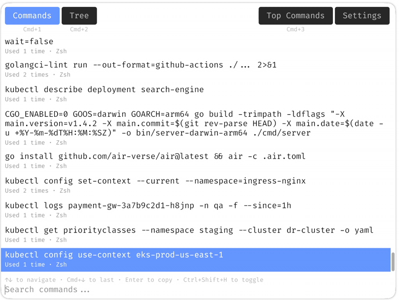

<p>
  
</p>

[](LICENSE)
[](https://go.dev/)

# Debrief

A hyper-charged reverse search: browse shell history in a GUI app available system-wide. 

Available on macOS, Windows, and Linux.

* No more pressing Ctrl+R 100 times — navigate visually.
* Browse history as a list, explore as a tree, or see your most-used commands.
* One shortcut to summon it from anywhere in the system.
* Support bash, zsh, powershell. 
* Find commands even with typos - fuzzy search support.
* Lightweight, offline, open source - no telemetry, no internet required.

<p>
  
</p>

## Download

| Platform | AMD64 | ARM64 |
|----------|-------|-------|
| **macOS** | [DMG (amd64)](https://github.com/debrief-dev/debrief/releases/download/1.0.0/debrief-macos-1.0.0-amd64.dmg) | [DMG (arm64)](https://github.com/debrief-dev/debrief/releases/download/1.0.0/debrief-macos-1.0.0-arm64.dmg) |
| **Windows (installer)** | [MSI (amd64)](https://github.com/debrief-dev/debrief/releases/download/1.0.0/debrief-windows-1.0.0-amd64.msi) | [MSI (arm64)](https://github.com/debrief-dev/debrief/releases/download/1.0.0/debrief-windows-1.0.0-arm64.msi) |
| **Windows (portable)** | [EXE (amd64)](https://github.com/debrief-dev/debrief/releases/download/1.0.0/debrief-windows-1.0.0-amd64.exe) | [EXE (arm64)](https://github.com/debrief-dev/debrief/releases/download/1.0.0/debrief-windows-1.0.0-arm64.exe) |
| **Ubuntu / Debian** | [DEB (amd64)](https://github.com/debrief-dev/debrief/releases/download/1.0.0/debrief-1.0.0-amd64.deb) | [DEB (arm64)](https://github.com/debrief-dev/debrief/releases/download/1.0.0/debrief-1.0.0-arm64.deb) |
| **Fedora / RHEL** | [RPM (amd64)](https://github.com/debrief-dev/debrief/releases/download/1.0.0/debrief-1.0.0-amd64.rpm) | [RPM (arm64)](https://github.com/debrief-dev/debrief/releases/download/1.0.0/debrief-1.0.0-arm64.rpm) |
| **Arch Linux** | [PKG (amd64)](https://github.com/debrief-dev/debrief/releases/download/1.0.0/debrief-1.0.0-amd64.pkg.tar.zst) | [PKG (arm64)](https://github.com/debrief-dev/debrief/releases/download/1.0.0/debrief-1.0.0-arm64.pkg.tar.zst) |
| **Any Linux** | [tar.xz (amd64)](https://github.com/debrief-dev/debrief/releases/download/1.0.0/debrief-1.0.0-amd64.tar.xz) | [tar.xz (arm64)](https://github.com/debrief-dev/debrief/releases/download/1.0.0/debrief-1.0.0-arm64.tar.xz) |

## Development

Project follows [Conventional Commits](https://www.conventionalcommits.org/en/v1.0.0/#specification) naming.

Prerequisites:

- [Go](https://go.dev/) 1.25.0
- [golangci-lint](https://golangci-lint.run/)


```sh
# Build & Run:
go run .

# Run tests
go test ./...

# Run linter
golangci-lint run --fix
```

## Architecture


```
Dependencies point downward: 
  Application → Infrastructure → Domain. 

Exception is `data/shell` → `infra/platform` for OS detection.


Application Layer:
  main.go       -> lifecycle
  app/          -> application state
  ui/           -> immediate-mode GUI rendering
    font/       -> embedded font assets

  Infrastructure Layer:
  infra/
    config/     -> configuration, persistence
    platform/   -> OS-specific path expansion, file ops, platform-detection
    hotkey/     -> global hotkey registration
    window/     -> window show/hide controller
    tray/       -> system tray icon and menu

  Domain Layer:
  data/
    model/      -> entities & value objects
    cmdstore/   -> aggregate: index, search, store
    syntax/     -> domain service: shell command parsing
    shell/      -> domain service: history file ingestion
    tree/       -> domain service: prefix tree build & flatten
    search/     -> domain service: fuzzy search, trigram index, scoring
```

## License

Copyright © 2026 bosiakov

Licensed under MIT (see [LICENSE](LICENSE)).

The font `ui/font/FiraCode-Regular.ttf` is licensed under the OFL-1.1. See [ui/font/LICENSE](ui/font/LICENSE) for details.

All fonts are legally licensed to Yauheni Basiakou via MyFonts.